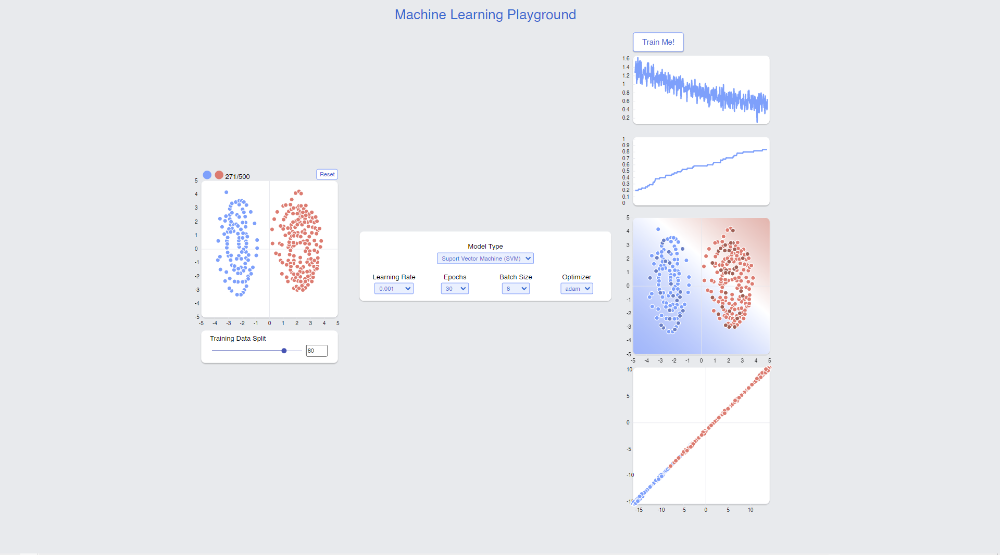

<p align="center"></p> 
<h2 align="center">Machine Learning Playground</h2>
<h4 align="center">A place to experiment with machine learning models.</h4>

<p align="center">
	
	
</p>

## Description

A machine learning playground using React.js and d3 for visualizing different algorithms that has a low-level dataset creation tool for generating a custom 2-cluster dataset for training. Yuo can train models ranging from SVMs, KNNs, and Naive Bayes to and MLPs (implamented using Pytorch and Scikit-Learn). The app uses a FastAPI backend with a websocket for visualizing model results in real-time and a SQLite database for storing the model data and metrics.

## Structure

| Codebase        |   Description   |
| :-------------- | :-------------: |
| [app]()            |   Playground   |
| [fastAPI](backend) | fastAPI Backend |

## Installation

You can install Heart Face the following method:

1. Clone the Repo and cd into it
   ```
   git clone https://github.com/kendreaditya/ml-playground.git
   cd ml-playground
   ```
2. Run the frontend app
   ```
   npm start
   ```
3. Run the backend
   ```
   cd backend
   uvicorn main:app
   ```

## Contribution

Whether you have ideas, translations, design changes, code cleaning, or real heavy code changes, help is always welcome.
The more is done the better it gets!
